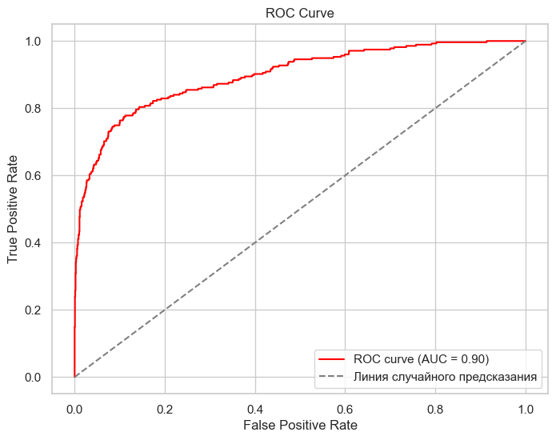
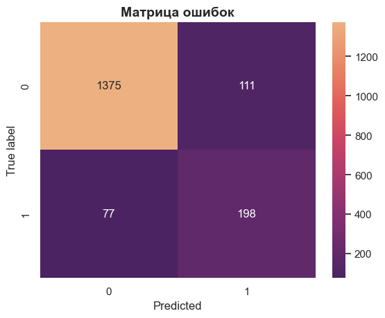
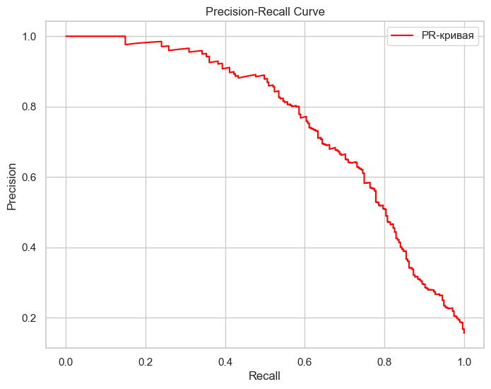

# ПРОЕКТ: ПРГОНОЗИРОВАНИЕ ОТТОКА КЛИЕНТОВ

## ОПИСАНИЕ
Оператор связи «ТелеДом» хочет бороться с оттоком клиентов. Для этого его сотрудники начнут предлагать промокоды и специальные условия всем, кто планирует отказаться от услуг связи. Чтобы заранее находить таких пользователей, «ТелеДому» нужна модель, которая будет предсказывать, разорвёт ли абонент договор (задача бинарной классификации).

## ЗАДАЧИ ПРОЕКТА
- Разработать модели для прогнозирования оттока клиента (бинарная классификация)
- Выбрать лучшую модель по результатам кросс-валидации
- Провести тестирование лучшей модели и получить метрику качества __ROC-AUC__ не ниже __0.85__
- Оценить важность признаков

## ИСХОДНЫЕ ДАННЫЕ
- таблицы с данными о клиентах и о предоставляемых им услугах в виде файла встраиваемой базы данных __SQLite__

## ЧТО БЫЛО СДЕЛАНО
### Загрузка, предобработка, EDA и подготовка данных:
- Для загрузки данных из БД использовался __SQLAlchemy__, что позволило подключаться к базе данных, выполнять SQL-запросы и провести первичную проверку таблиц на соответствие описанию.
- Для обработки данных использовалась библиотека __pandas__.
- Проведено заполнение пропусков.
- Исследовательский анализ данных включал визуализацию и изучение распределения признаков в разрезе целевой переменной, а так же анализ корреляции признаков средствами библиотеки __phik__.
- Для обработки категориальных признаков был использован __TargetEncoder__ из библиотеки __category_encoders__.
- Количественные признаки для "не деревянных" моделей данные были нормализованы с помощью __MinMaxScaler__, чтобы привести все признаки к одному масштабу.

### Разделение данных на обучающую и тестовую выборки:
- Для деления данных использовались инструменты из __sklearn.model_selection__, такие как __train_test_split__ и __StratifiedKFold__, что обеспечило равномерное распределение классов в обучающей и тестовой выборке, а также подготовку данных для кросс-валидации.

### Моделирование:
- Для классификации использовались различные модели, включая случайный лес __(__RandomForestClassifier__), бустинг (__LGBMClassifier__), а также нейронная сеть с использованием __TensorFlow__ и __Keras__ с применением регуляризации (L2-регуляризатор), __BatchNormalization__ и слоями __Dropout__.
- Применялся __ReduceLROnPlateau callback__ для изменения скорости обучения в процессе тренировки, если метрика не улучшалась.

### Подбор гиперпараметров:
- Для подбора оптимальных гиперпараметров использовался инструмент __Optuna__ с интеграцией с __OptunaSearchCV__.

### Оценка качества моделей:
- Для оценки качества моделей использовались несколько метрик: AUC (с помощью __roc_auc_score__), точность, полнота, F1-метрика, а также матрица ошибок (__confusion_matrix__).
- Визуализировались кривые ROC и __precision-recall__ с помощью функций из __sklearn.metrics__.

### Анализ важности признаков:
- Для анализа важности признаков использовался инструмент __shap__, который позволяет визуализировать вклад каждого признака в предсказания модели.

## РЕЗУЛЬТАТЫ
Лучшие результаты на кросс-валидации показала модель на основе бустинга - __LGBMClassifier__

1. __ROC-AUC = 0.898__ - это значение говорит нам о том, что если взять случайным образом 2 абонентов, одного "ушедшего", второго нет, то с вероятностью почти 0.9 "ушедшему" будет присвоена бОльшая вероятность старшего класса. Данная метрика не показывает количественное распределение присвоенных меток класса.

2. __Accuracy = 0.893__ - это доля всех правильно предсказанных клиентов (и остающихся, и уходящих). Если отток редкий (например, 10% клиентов уходят), модель может просто предсказывать "остался" (0) и получать высокий accuracy. Нужно смотреть Precision и Recall для лучшей оценки.
	
3. __Precision = 0.641__ - из всех клиентов, которых модель пометила как "уйдут", около 64% действительно уходят. Это важно, если компания хочет не тратить ресурсы на ложные срабатывания (не уговаривать остающихся клиентов).

4. __Recall = 0.72__ - Recall показывает, сколько реальных оттоков из их общего числа модель поймала. Только около 72% уходящих клиентов распознаны. Это плохо, если бизнес хочет спасать максимум клиентов!

 ## РЕКОМЕНДАЦИИ ЗАКАЗЧИКУ
1. Что можно улучшить? Повысить Recall, чтобы спасти больше клиентов. Для этого можно учитывать более низкий порог вероятности чтобы ловить больше уходящих клиентов. Например, по графику PR-кривой видно, что если необходимо ловить 80 % уходящих клиентов, то точность модели упадет до 50 %, т.е. количество ложных тревог вырастет. Если важнее не тратить ресурсы — оставить Precision выше. Если важнее не терять клиентов — увеличить Recall.

2. Исходя из результатов исследователского анализа данных и анализа важности признаков (диаграмма SHAP-значений) необходимо обращать внимание на клиентов со сроком действия контракта от 500 до 1500 дней, так как в этом диапазоне лежит наибольшая плотность уходящих клиентов. Кроме того, на сохранение клиентов благоприятно вляют невысокие расходы абонента на услуги связи.